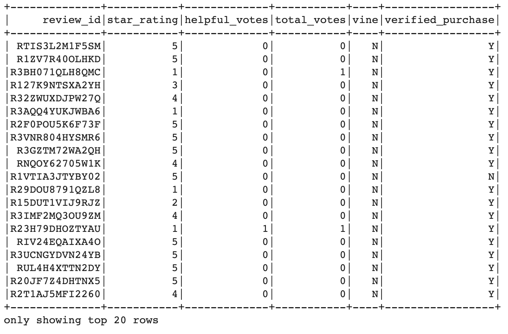
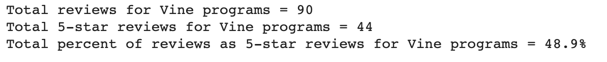
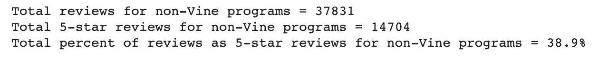

# Amazon_Vine_Analysis

## Overview of Analysis
Analyzing Amazon reviews written by members of the paid Amazon Vine program to determine if there is any bias toward favorable reviews from Vine members.

## Data Resource
https://s3.amazonaws.com/amazon-reviews-pds/tsv/amazon_reviews_us_Video_Games_v1_00.tsv.gz

## Analysis of Results
Vine Table:

The summary of total Vine reviews:

Total reviews for Vine programs = **90**
Total 5-star reviews for Vine programs = **44**
Total percent of reviews as 5-star reviews for Vine programs = **48.9%**

The summary total of non-Vine reviews:

Total reviews for non-Vine programs = **37831**
Total 5-star reviews for non-Vine programs = **14704**
Total percent of reviews as 5-star reviews for non-Vine programs = **38.9%**

While there was a much smaller sample size for comparison, there were 10% more 5-star reviews of the total reviews for Amazon Vine programs compared to non-Vine programs. This suggests a positivity bias towards higher reviews for people who are paid to write reviews.
